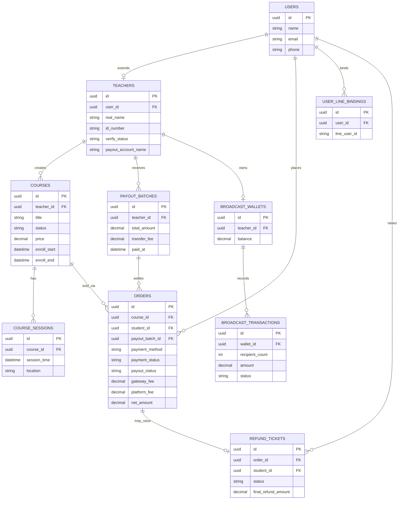

# 課程平台金流與帳務系統規劃（更新版 v2）

## 一、付款方式：老師可選 ATM 或信用卡

### 設計邏輯
每堂課程由老師自行設定「接受的付款方式」，可複選：
- 只開 ATM 虛擬帳號
- 只開信用卡
- 兩者都開，讓學生自行選擇

### 對系統的影響
- 建立課程時，老師端要有付款方式勾選欄位，存進課程設定
- 學生報名頁面，依老師設定的付款方式動態顯示選項
- 呼叫綠界/藍新 API 時，`ChoosePayment` 參數依老師設定帶入（`ATM`、`Credit`、或 `ALL`）
- 不同付款方式的手續費率不同，需個別記錄在訂單成本欄位

### 兩種付款方式的差異（提醒老師選擇時參考）
| 項目 | ATM 虛擬帳號 | 信用卡 |
|---|---|---|
| 手續費 | 約 1%（最低 15 元） | 約 2.75%～2.89% |
| 到帳速度 | 較慢，需等銀行確認（可能延遲數小時到隔天） | 較快 |
| 學生付款便利性 | 需自行操作轉帳，有繳費期限，可能忘記繳 | 一次點擊完成，轉換率較高 |
| 適合情境 | 學生對信用卡付款有疑慮、客單價高想避免刷卡手續費 | 想提高報名轉換率、避免學生忘記繳費 |

---

## 二、老師身分驗證（輕量驗證，MVP 起點）

平台是綠界的特店（合約主體是你，不是老師），且是資金實際持有者（代收轉付），需要基本把關避免詐騙老師收款跑路造成平台信譽與法律風險。**採用「輕量驗證」等級**，不做到正式 KYC，之後平台規模變大再升級。

### 老師註冊需完成的步驟
1. **填寫真實姓名 + 身分證字號**（僅存內部資料庫，不對學生顯示）
2. **上傳身分證正反面照片**，供平台人工審核（一次性審核，量小時不用串第三方驗證 API）
3. **綁定撥款銀行帳戶**，戶名**必須與註冊姓名一致**——系統強制檢查，這是成本最低、效果最好的防線，因為銀行轉帳本身就會核對戶名
4. **線上勾選同意合作條款**（費用結構、退款規則、身分聲明等，見第七節費用揭露）

### 審核流程
- 老師送出資料 → 進入「待審核」狀態，尚不能發佈課程
- 平台人工review身分證與註冊資料是否一致 → 通過後轉為「已認證」，開放課程建立功能
- 之後平台規模變大、單月撥款金額變高時，可升級為正式 KYC（串接第三方身分驗證/自然人憑證、對高額撥款老師加強審查、黑名單查詢）

### 資料庫欄位（老師資料表新增）
| 欄位 | 說明 |
|---|---|
| 真實姓名 | 身分驗證用，不對外顯示 |
| 身分證字號 | 加密儲存 |
| 身分證照片 | 存物件儲存（S3/R2），僅平台管理員可讀取 |
| 審核狀態 | 待審核／已認證／已退回（需補件）／已封鎖 |
| 撥款銀行帳戶戶名 | 系統比對是否等於真實姓名 |
| 撥款銀行帳戶號碼 | |

---

## 三、費用結構：四層成本

每一筆訂單金額，從學生付款到老師實際入帳，會經過**四層扣除**（撥款轉帳成本現在也計入老師成本，見第六節說明）：

```
學生付款金額（課程原價）
    − 金流成本（綠界/藍新手續費，依付款方式而定）
    − 平台服務費（你的抽成，依方案而定）
    − 撥款轉帳成本（平台轉帳給老師銀行帳戶的手續費）
    ────────────────────────
    = 老師實際應收淨額
```

### 舉例（信用卡付款，課程 3,000 元，平台抽成 10%，跨行轉帳手續費 20 元）
| 項目 | 金額 |
|---|---|
| 學生付款 | 3,000 元 |
| 金流手續費（2.89%） | −87 元 |
| 平台服務費（10%，以原價計算） | −300 元 |
| 撥款轉帳手續費（單筆分攤） | −20 元 |
| **老師應收淨額** | **2,593 元** |

> 平台服務費要明確定義是「以原價計算」還是「以扣除金流成本後的淨額計算」，兩者結果不同，建議在老師合約/後台說明清楚，避免爭議。
>
> 撥款轉帳手續費是**每次撥款批次**的成本（例如月結一次轉帳 20 元），需要依該批次撥款涵蓋的訂單數量分攤到每筆訂單，或簡化為「每次撥款扣一筆固定金額」，不逐筆分攤到訂單明細（實作方式見第五、六節）。

---

## 四、帳務系統：明細與報表

### 每筆訂單要記錄的欄位
| 欄位 | 說明 |
|---|---|
| 訂單編號 | 對應綠界 `MerchantTradeNo` |
| 學生資訊 | 姓名、聯絡方式 |
| 課程資訊 | 課程名稱、老師 |
| 付款方式 | ATM／信用卡 |
| 課程原價 | 學生實際付款金額 |
| 金流手續費 | 依付款方式與費率計算 |
| 平台服務費 | 依抽成比例計算 |
| 付款狀態 | 待付款／已付款／已退款 |
| 撥款狀態 | 待撥款／可撥款／已撥款 |
| 付款時間 | 綠界背景通知回傳時間 |

### 每次撥款批次要記錄的欄位（新增）
| 欄位 | 說明 |
|---|---|
| 撥款批次編號 | |
| 涵蓋訂單清單 | 本次撥款包含哪些訂單 |
| 訂單淨額加總 | 扣除金流成本＋平台服務費後的加總 |
| 撥款轉帳手續費 | 這次轉帳銀行收取的成本 |
| 老師實收金額 | 訂單淨額加總 − 撥款轉帳手續費 |
| 撥款時間 | 實際轉帳時間 |
| 轉帳憑證/流水號 | |

> 把撥款轉帳手續費放在「批次」層級而不是逐筆訂單層級，是因為轉帳成本本來就是「一次撥款」產生一次，不是每筆訂單各自產生。老師報表上可以呈現「本次撥款：訂單淨額加總 X 元 − 轉帳手續費 Y 元 = 實收 Z 元」，清楚但不用把 Y 拆到每筆訂單上（除非未來要做到「每筆訂單即時撥款」，那時才需要逐筆計算）。

### 老師後台報表功能
- **本期收入總覽**：報名筆數、總營收（毛額）、總扣除成本（金流成本＋平台服務費＋撥款轉帳手續費）、應收淨額
- **明細清單**：可依日期區間篩選，逐筆列出訂單成本明細
- **撥款紀錄**：歷次撥款批次，含轉帳手續費與實收金額
- **匯出功能**：Excel/CSV，**免費**，方便老師自行報稅或核對

### 平台端（你自己的）總帳
- 綠界/藍新撥入平台帳戶的總額
- 依老師拆分後的應付總額
- 平台實際留存的服務費收入
- 待撥款總額（負債概念，尚未撥給老師的錢）
- 撥款轉帳手續費支出總額（平台先墊付，再從老師撥款中扣回）

---

## 五、撥款流程設計

1. **訂單成立** → 學生付款 → 綠界背景通知你 → 更新訂單為「已付款」
2. **保留期判斷**：建議設定保留期（例如課程開課後 7 天，或退款保護期過後），避免撥款後又要退款
3. **進入待撥款清單**：保留期過後，該筆訂單標記為「可撥款」
4. **撥款批次作業**：依設定頻率（建議先做**月結**，之後再視需求提高到週結）
5. **計算本次撥款金額**：訂單淨額加總 − 本次撥款轉帳手續費 = 老師實收金額
6. **執行撥款**：轉帳給老師（人工或串接銀行 API 自動化），系統記錄撥款憑證
7. **標記已撥款**，老師後台同步更新狀態，顯示完整扣除明細

---

## 六、撥款轉帳手續費：算在老師成本內

### 資金流的兩段轉帳成本
| 環節 | 成本 | 由誰負擔 |
|---|---|---|
| 你從綠界/藍新提領到平台帳戶 | 綠界跨行提領 15 元／筆（永豐免費）；藍新每月前 5 次免費，第 6 次起 10 元／筆 | **平台吸收**（這是你跟金流商之間的成本，不轉嫁給老師，因為老師感知不到這層） |
| 你轉帳給老師的銀行帳戶 | 依銀行而定，跨行轉帳約 15～30 元／筆，同行通常免費 | **算入老師成本**（依你的最新決定） |

### 具體做法
- 平台統一使用**永豐銀行帳戶**接收綠界/藍新撥款，完全省掉第一段提領手續費
- 每次撥款給老師時，該次轉帳的手續費（跨行約 15～30 元，同行銀行間可能免費），**從該批次的老師應收淨額中扣除**
- 若老師的撥款銀行帳戶剛好跟平台是同一家銀行（同行免手續費），系統可自動判斷免收這筆費用，鼓勵老師使用同行帳戶降低成本（也可以在老師綁定帳戶時，用小提示告知「選擇 OO 銀行帳戶可省下轉帳手續費」）

---

## 七、費用揭露原則：什麼時候要讓老師知道

因為手續費結構變得比較複雜（金流成本＋平台抽成＋撥款轉帳手續費），必須在**老師實際被扣款之前**，多個時間點都清楚說明，避免事後爭議：

| 時機 | 要揭露的內容 |
|---|---|
| **老師註冊/加入審核時** | 完整費用結構說明頁面：金流手續費率（依付款方式）、平台服務費比例、撥款轉帳手續費規則。要求老師**勾選同意**後才能繼續 |
| **建立課程時** | 即時試算範例：輸入課程售價，系統即時顯示「學生付款 X 元 → 老師預估可收到 Y 元」，讓老師在訂價時就能預估實拿金額 |
| **學生報名成立、老師收到通知時** | 該筆訂單的成本明細（不用到扣款程度的細節，但至少讓老師知道這筆訂單大概能拿多少） |
| **每次撥款時** | 完整明細：涵蓋哪些訂單、金流成本、平台服務費、撥款轉帳手續費、最終實收金額，並可下載/匯出留存 |
| **費率異動時**（未來調整費率） | 提前通知（建議至少 30 天），不溯及既往已成立的訂單 |

### 技術實作提醒
- 「建立課程時的即時試算」建議做成前端即時計算的小工具（輸入售價，即時顯示分潤結果），不用打 API，用固定費率公式前端計算即可，體驗會比較好
- 費用條款文字本身建議做**版本控管**（老師同意的是哪個版本的條款），未來費率調整時才能追溯老師當初同意的內容

---

## 八、後續開發優先順序建議

1. 老師端：註冊 + 身分驗證審核流程
2. 老師端：課程建立 + 付款方式選擇 + 費用試算工具
3. 學生端：報名 + 依老師設定顯示付款選項
4. 金流串接：綠界/藍新 API（下單、背景通知接收、狀態更新）
5. 帳務核心：訂單成本自動計算（金流成本＋平台抽成）
6. 老師後台：收入報表 + 明細匯出
7. 撥款批次作業（含撥款轉帳手續費計算，先手動觸發，之後再做自動化/銀行 API）
8. 退款與撥款後退款的沖銷機制

---

## 九、LINE 官方帳號推播成本與計費設計

### LINE 官方帳號訊息費用結構（2026 現行方案，實際費率以 LINE 官方公告為準）
| 方案 | 月費（未稅） | 免費訊息 | 加購 |
|---|---|---|---|
| 輕用量 | 0 元 | 200 則/月 | 不可加購 |
| 中用量 | 800 元 | 3,000 則/月 | 不可加購，超過需升級高用量 |
| 高用量 | 1,200 元 | 6,000 則/月 | 可加購，第 1～50,000 則 0.2 元/則，第 50,001 則起 0.15 元/則（階梯式累進） |

**重點限制**：訊息額度是整個平台官方帳號共用，不是每位老師各自一份，全平台所有老師、所有學生的主動推播共用同一份額度。

### 兩種訊息類型，成本天差地遠
| 類型 | 觸發方式 | 是否計費 |
|---|---|---|
| Push Message（推播） | 系統主動發起（繳費提醒、開課提醒） | 計入訊息額度 |
| Reply Message（回覆） | 學生主動傳訊/點 Rich Menu，系統於同一 webhook 事件回覆 | 不計費 |

**設計原則**：學生主動查詢類功能（我的課程、繳費狀態）一律用 Reply 實作；只有系統主動發起的通知（繳費提醒、開課提醒、候補遞補）才走 Push。

### 成本歸屬與計費方式：分兩類處理

**A. 核心必要通知（報名成功、繳費提醒、開課提醒、退款完成）**
- 平台吸收，內含在平台服務費/抽成比例中，老師無感、不另外收費
- 這是平台承諾的服務品質基礎，不應讓老師覺得基本通知要額外付費
- 需在估算抽成比例時，把 LINE 訊息費用當成固定營運成本納入考量

**B. 老師主動發起的行銷群發（例如推廣新課程給自己的粉絲）**
- 採**預付儲值錢包**機制計費，逐則收費，避免呆帳

### 廣告錢包機制設計

**計價**：
| 項目 | 說明 |
|---|---|
| LINE 實際成本 | 約 0.2 元/則起（依用量級距） |
| 平台售價 | 建議 0.5～1 元/則（涵蓋 LINE 固定月費分攤、發送失敗重試、維運成本） |

**發送流程（先收費、後服務，杜絕呆帳）**：
1. 老師撰寫廣告訊息，系統顯示「目前粉絲數 → 預估則數 → 預估費用」
2. 老師確認發送 → 系統檢查廣告錢包餘額
   - 餘額不足 → 擋下發送，導引去儲值
   - 餘額足夠 → **確認發送當下**立即扣款（以送出當下的實際粉絲數為準，非編輯頁面看到的預估數字）
3. 扣款完成後才呼叫 LINE API 實際發送

**廣告錢包資料設計**：
- 獨立於課程營收帳戶的預付儲值錢包
- 儲值走既有金流（綠界/藍新），視為新的訂單類型（`order_type: broadcast_credit`），沿用同一套金流串接，不必另建第二套
- 建議設定最低儲值金額（例如 500 元），減少小額儲值造成的金流手續費負擔
- 消費紀錄需記錄：發送時間、訊息摘要、發送人數、扣款金額

**例外情況處理**：
| 情況 | 處理方式 |
|---|---|
| 系統端/API 呼叫失敗（未真正送出） | 自動退款回錢包 |
| API 呼叫成功但學生端收不到（如已封鎖官方帳號） | 仍算已扣款（LINE 計費以呼叫 API 為準，非送達/已讀） |
| 錢包餘額退款 | 建議限平台內使用，不提供現金退還（比照點數/儲值制常見做法），需在儲值頁面清楚告知 |

### 法規提醒
廣告錢包本質是預收款/儲值服務，規模做大後可能落入預收款相關消費者保護規範（例如是否需要履約保證機制）。現階段規模小可先上線，規模變大後建議諮詢律師/會計師確認合規需求。

---

## 十、後續開發優先順序（更新）

1. 老師端：註冊 + 身分驗證審核流程
2. 老師端：課程建立 + 付款方式選擇 + 費用試算工具
3. 學生端：報名 + 依老師設定顯示付款選項
4. 金流串接：綠界/藍新 API（課程訂單 + 廣告錢包儲值，共用同一套串接）
5. 帳務核心：訂單成本自動計算（金流成本＋平台抽成）
6. 老師後台：收入報表 + 明細匯出
7. 撥款批次作業（含撥款轉帳手續費計算）
8. 退款與撥款後退款的沖銷機制
9. LINE Bot：會員綁定、Rich Menu、核心通知（Reply 優先，Push 用於必要通知）
10. LINE 廣告錢包：儲值、預估試算、扣款流程

---

## 十一、退課仲裁工單流程（老師端 + 管理者端）

### 狀態流程
```
[學生提出退課申請]
        ↓
[系統自動檢查退費規則]
        ↓
   ┌────┴────┐
超過退費期限      在退費期限內
   ↓                ↓
系統自動駁回      進入「老師審核中」
（學生可申訴）        ↓
   ↓            老師核准 / 老師駁回
   ↓                ↓         ↓
   ↓            退款處理中   學生決定
   ↓                ↓      ┌───┴───┐
   ↓             已完成   接受結案  升級仲裁
   └──────────────────────────┘        ↓
                                  平台仲裁中
                                       ↓
                              管理者最終裁決
                                       ↓
                            退款處理中 / 已駁回結案
```

### 各狀態權限與動作
| 狀態 | 誰能操作 | 可做的動作 |
|---|---|---|
| `submitted` | 學生建立，系統自動處理 | 系統依課程退費規則自動試算金額與是否在期限內 |
| `auto_rejected` | 學生 | 若不服可直接點「申訴」升級給管理者，不需透過老師 |
| `teacher_reviewing` | 老師 | 核准（可依系統試算金額，或在允許範圍內調整並填理由）／駁回（需填理由） |
| `student_deciding` | 學生 | 接受駁回（結案）／升級仲裁 |
| `admin_arbitration` | 管理者 | 檢視雙方留言記錄與訂單資料，做最終裁決：核准全額/部分退款/維持駁回 |
| `refund_processing` | 系統/管理者 | 信用卡走 API 自動退款；ATM 訂單標記需人工轉帳 |
| `completed` / `closed` | — | 終態，記錄留存 |

### 關鍵設計細節
1. **SLA 逾時自動升級**：老師進入審核中狀態後設定回應期限（建議 3 個工作天），逾期未處理系統自動升級到管理者仲裁，避免老師已讀不回導致學生投訴無門
2. **共用留言/證據串**：學生與老師的往來記錄雙方都看得到，升級仲裁時管理者直接看到完整記錄，不用重新問一次
3. **老師核准金額可微調**：允許老師在系統試算金額範圍內調整（但不能超過原始繳費金額），需填理由並記錄留存
4. **裁決後的扣款來源**：
   - 訂單尚未撥款給老師 → 直接從平台帳戶退款，該筆訂單不進入下次撥款清單
   - 訂單已撥款給老師 → 標記「從老師下期撥款中扣回」，並通知老師扣款原因
5. **ATM 訂單特殊標記**：核准退款後，ATM 訂單無法透過 API 自動退款，系統自動標記「待人工轉帳」，管理者轉帳後手動回填憑證才能結案

### 資料模型（新增工單表）
| 欄位 | 說明 |
|---|---|
| ticket_id | |
| order_id | 關聯原始訂單 |
| student_id / teacher_id | |
| status | 見上方狀態表 |
| reason | 學生填寫的退課原因 |
| system_calculated_refund | 系統依規則試算的金額 |
| final_refund_amount | 實際核准金額（可能被老師/管理者調整） |
| teacher_response_deadline | SLA 期限，用於自動升級判斷 |
| teacher_decision / teacher_note | |
| admin_decision / admin_note | 只有升級仲裁才有值 |
| refund_method | 信用卡自動／ATM人工 |
| deducted_from_payout | 是否從老師下期撥款扣回 |

### 老師/管理者後台畫面差異
- **老師後台**：只看得到自己課程的退課工單，待處理排最前面，有 SLA 倒數提示
- **管理者後台**：只顯示 `admin_arbitration` 狀態的工單為主要待辦，另設「全部工單」總覽供查歷史記錄

---

## 十二、系統架構總覽（三層模型）

- **資料層**：老師與管理者看到的學生/訂單資料是同一份，差別在 API 查詢時是否加上 `teacher_id` 範圍限制（RBAC + Row-level 權限控管）
- **UI 元件層**：表格、篩選器、狀態標籤等共用元件庫，建議用 monorepo 管理（如 Turborepo/Nx），拆成 `teacher-portal`、`student-site`、`admin-panel` 三個應用共用 `ui-components`
- **應用/權限層**：老師後台與管理者後台是各自獨立的登入系統與應用，管理者後台建議獨立網域、可加 IP 白名單與強制雙因素驗證

---

## 十三、資料庫 ER 圖



### 關聯說明
- **USERS 是根**：學生與老師共用同一套會員系統，`TEACHERS` 是老師身分的延伸表（1 對 1），存身分驗證欄位
- **COURSES → COURSE_SESSIONS**：一堂課可以有多個場次（系列課設計，MVP 階段先不做）
- **ORDERS 是核心交易表**：連結學生與課程，記錄金流成本、平台服務費、淨額；`payout_batch_id` 記錄該筆訂單被哪次撥款批次結算
- **REFUND_TICKETS**：一筆訂單最多對應一張退款工單
- **PAYOUT_BATCHES**：一位老師的一次撥款，涵蓋多筆訂單（一對多）
- **BROADCAST_WALLETS / BROADCAST_TRANSACTIONS**：每位老師一個廣告錢包（1 對 1），底下多筆儲值/扣款交易記錄（MVP 階段不做）
- **USER_LINE_BINDINGS**：會員可綁定 LINE 帳號，供推播與 LINE 登入使用

---

## 十四、MVP 範圍界定

MVP 目標：驗證「老師能開課、學生能付款報名、老師能收到錢」的核心迴圈。

### 老師端
| 功能 | MVP | Phase 2 |
|---|---|---|
| 註冊 + 輕量身分驗證 | ✅ | — |
| 課程建立（單堂課） | ✅ | — |
| 招生頁編輯器（貼上AI文案+圖片，簡化版） | ✅ | 區塊化排版優化 |
| 系列課（多場次） | ❌ | ✅ |
| 付款方式選擇（ATM/信用卡） | ✅ | — |
| 學生名單+繳費狀態查看 | ✅ | — |
| 收入報表/匯出（基本版） | ✅ | 圖表視覺化 |
| 退課退費規則（簡化：固定百分比+固定天數） | ✅ | 複雜自訂規則 |

### 學生端
| 功能 | MVP | Phase 2 |
|---|---|---|
| 課程列表+基本篩選 | ✅ | 進階篩選 |
| 課程詳情頁 | ✅ | — |
| 報名+付款流程 | ✅ | 優惠券/折扣碼 |
| 會員中心（我的課程、繳費狀態） | ✅ | 收藏課程、追蹤老師 |
| 候補機制 | ❌ | ✅ |
| 評價/評論系統 | ❌ | ✅ |
| 課前 Q&A | ❌ | ✅ |

### 金流與帳務
| 功能 | MVP | Phase 2 |
|---|---|---|
| 綠界/藍新串接（ATM+信用卡） | ✅ | — |
| 訂單成本自動計算 | ✅ | — |
| 撥款批次（人工觸發+人工轉帳） | ✅ | 自動化銀行API撥款 |
| 撥款轉帳手續費計入老師成本 | ✅ | — |
| 退款（信用卡API自動、ATM人工） | ✅ | — |

### 退課仲裁
| 功能 | MVP | Phase 2 |
|---|---|---|
| 申請退課、系統試算、老師核准/駁回 | ✅ 基本流程 | — |
| SLA 自動升級管理者 | ❌（管理者人工盯著） | ✅ |
| 完整留言串/證據系統 | ❌（簡化成備註欄位） | ✅ |

### LINE Bot / 會員
| 功能 | MVP | Phase 2 |
|---|---|---|
| LINE Login 綁定會員 | ✅ | — |
| 核心通知（繳費提醒、開課提醒，Push） | ✅ | — |
| Rich Menu 查詢功能（Reply） | ❌ | ✅ |
| 老師端 LINE 通知 | ❌ | ✅ |
| 廣告錢包（老師付費群發） | ❌ | ✅ |

### 管理者後台
| 功能 | MVP | Phase 2 |
|---|---|---|
| 老師審核佇列 | ✅ | — |
| 撥款批次操作 | ✅ | — |
| 退款仲裁處理（簡化版） | ✅ | — |
| 角色分級權限 | ❌（單一admin帳號） | ✅ |
| 系統監控儀表板 | ❌（直接查資料庫） | ✅ |

### MVP 核心迴圈
```
老師註冊 → 身分審核通過 → 建立課程（招生頁+定價+退費規則）
    ↓
學生瀏覽課程 → 報名 → 選付款方式 → 完成付款（ATM/信用卡）
    ↓
綠界/藍新背景通知 → 系統更新繳費狀態 → LINE/Email通知
    ↓
老師後台查看報名名單與繳費狀態
    ↓
（若有退課）學生申請 → 老師審核 → 核准/駁回
    ↓
月結：管理者觸發撥款批次 → 人工轉帳給老師 → 回填憑證
```

### 開發排序
1. 資料庫建置（依上方 ER 圖，先建 MVP 需要的表）
2. 老師端：註冊審核 + 課程建立（簡化版編輯器）
3. 學生端：瀏覽 + 報名 + 付款
4. 金流串接（關鍵路徑，建議與第 2、3 步平行開發）
5. 帳務計算邏輯 + 老師報表
6. 管理者後台：審核、撥款、仲裁（簡化版）
7. LINE Login 綁定 + 核心通知（Push）

---

## 十五、學生註冊欄位與通知管道設計

### 註冊欄位規則
| 欄位 | 是否必填 | 用途 |
|---|---|---|
| 手機號碼 | 必填 | 身分識別、緊急聯絡（如臨時停課、退課爭議需直接聯繫時使用） |
| Email | 選填，但建議填寫（表單旁加提示文案） | 主要的自動通知投遞管道 |

驗證邏輯：手機號碼為空則擋下註冊；Email 不擋，選填即可。資料庫 `users` 表 `phone` 欄位設為 `NOT NULL`，`email` 維持可為 `NULL`。

### 通知管道優先順序
```
訂單狀態變更（例如：已付款）
    ↓
系統發出事件
    ↓
有留 Email → 寄送 Email（自動化通知的主要保底管道）
    ↓
無論有無 Email → 站內會員中心一律留一份通知記錄
    ↓
如果學生有綁定 LINE → 額外推播 LINE（加值，非必要）
```

要點：
- 手機號碼在 MVP 階段用途是身分識別與人工緊急聯絡，**不是自動化簡訊通知管道**（簡訊發送需另外串接服務商，MVP 不做）
- Email 是自動化通知（繳費提醒、開課提醒、退款結果）的主要保底管道
- LINE 推播僅在學生主動綁定後才會額外收到，屬於加值體驗，非必要管道；未綁定 LINE 的學生不會因此收不到核心通知（Email 已保底）
- 若學生完全沒填 Email 也沒綁 LINE，僅能透過登入會員中心查看通知記錄，屬於 MVP 階段可接受的落差

---

## 十六、學生會員中心與 LINE Bot 綁定邏輯

### 「我的課程」分頁邏輯
| 分頁 | 判斷條件 |
|---|---|
| 待繳費 | `payment_status = pending` |
| 即將上課 | `payment_status = paid` 且 `session_time > 現在` |
| 已結束 | `payment_status = paid` 且 `session_time < 現在` |
| 已取消/已退款 | `refund_ticket.status = completed` 或學生自行取消 |

四個分頁皆由 `orders` 表依狀態與時間欄位篩選，不需額外狀態欄位。

### 訂單/收據記錄
MVP 階段僅做「付款證明」層級（訂單編號、課程名稱、金額、付款時間、付款方式，可下載/列印），不做正式電子發票（涉及財政部串接，列入 Phase 2）。

### LINE 綁定流程
```
學生點擊「LINE 登入/綁定」→ 取得 LINE userId
    ↓
查詢該 LINE userId 是否已綁定過帳號
    ├─ 有 → 直接登入該帳號
    └─ 沒有 → 若能取得 email 且系統已有該 email 帳號 → 詢問是否綁定現有帳號
              → 否則直接建立新帳號並綁定 LINE
```
MVP 簡化：LINE 不一定提供 email，若拿不到 email 一律視為新帳號，不做複雜帳號合併邏輯（邊緣案例量少，先人工處理）。

### 核心通知觸發點（MVP 僅 Push，不做 Rich Menu/Reply）
| 觸發事件 | 通知內容 |
|---|---|
| ATM 訂單成立 | 虛擬帳號、金額、繳費期限 |
| 付款完成 | 報名成功確認 |
| 繳費期限前 X 小時未繳 | 逾期提醒 |
| 開課前 X 小時 | 上課提醒 |
| 退課申請核准/駁回 | 通知結果 |

老師端 MVP 完全不做 LINE 通知（Phase 2）。訊息文字建議存成資料庫範本（`notification_templates` 表，含變數如 `{course_name}` `{amount}` `{deadline}`），不寫死在程式碼中，方便之後調整文案不需重新部署。

---

## 十七、老師合作條款同意流程

### 同意情境設計
| 情境 | 觸發時機 | 同意內容 |
|---|---|---|
| 初次同意 | 老師身分審核通過後、可建立課程前 | 完整合作條款：費用結構、退款政策、平台責任範圍、資料使用等 |
| 異動重新同意 | 平台調整費率或條款內容時 | 僅需針對異動部分重新同意 |

順序為：註冊填資料 → 身分審核 → 通過後進入「合作條款同意」 → 同意後才開放課程建立功能。身分審核前不要求簽署完整合約。

### 條款版本控管
```
條款版本表（terms_versions）
  id / version_number / effective_date / content / created_at

老師同意記錄表（teacher_agreements）
  id / teacher_id / terms_version_id / agreed_at / ip_address
```
每次條款修改新增一筆版本，不覆蓋舊版本。老師同意記錄綁定「同意的是哪個版本」，供未來爭議查證。

### 費率調整通知與重新同意流程
```
管理者發佈新版條款（設定生效日，如30天後）
    ↓
系統通知全部老師（Email+站內）：費率將於X日調整
    ↓
生效日前，老師登入後台顯示強制彈窗（不可跳過）：新舊條款差異
    ↓
老師點擊「已閱讀並同意」→ 記錄新的 teacher_agreements
    ↓
生效日到達：
  已同意老師 → 正常使用，新費率生效
  未同意老師 → 暫時無法發佈新課程（已有進行中訂單不受影響，走舊版規則結算）
```

**關鍵技術細節**：`orders` 表需記錄 `terms_version_id`，撥款計算時依訂單成立當下適用的條款版本計算費率，不因老師之後同意新條款而回溯修改舊訂單費率（不溯及既往）。

### 合約內容範圍（供參考，法律文字建議由律師撰寫/審閱）
- 費用結構（金流成本、平台服務費比例、撥款轉帳手續費歸屬）
- 撥款頻率與保留期規則
- 退款/退課政策與爭議仲裁機制（平台有最終裁決權）
- 身分驗證與帳戶封鎖條件
- 資料使用範圍（學生資料僅供該老師管理自己課程使用，不可外流）
- 智慧財產權（招生頁文案、課程內容歸屬老師，授權平台展示使用）
- 終止合作的條件與流程

---

## 十八、客服/爭議升級後的真人介入機制

### 何時需要真人介入（電話/Email），而非純線上工單
| 情況 | 處理方式 |
|---|---|
| 一般退課爭議（金額、規則認知不同） | 線上工單留言串處理即可 |
| 學生情緒激動、投訴、揚言負評/申訴消保單位 | 需管理者主動聯繫安撫、釐清狀況 |
| 涉及金額較大或多筆訂單的爭議 | 建議主動致電，避免線上往返曠日廢時 |
| 老師本人失聯 | 管理者需循身分驗證資料主動聯絡，甚至涉及帳戶凍結 |

原則：多數升級工單仍以線上處理為主，電話介入是工單卡住或風險升高時的加碼動作。

### 通話/信件記錄需寫回系統
```
管理者撥打電話/寄送Email給學生或老師
    ↓
聯繫結束後，回到工單系統新增「內部備註」（僅管理者可見）
    ↓
內容：聯繫時間、方式、對方陳述重點、達成共識或後續處理方向
    ↓
依共識繼續線上流程（維持/調整金額、駁回並附上溝通結果）
```

**資料模型（新增內部備註子表，與雙方可見的留言串分開）**：
```
ticket_internal_notes
  id / ticket_id / admin_id / contact_method (phone/email/other) / note_content / created_at
```

### 聯絡方式來源
電話聯絡號碼來源即註冊必填的手機欄位（呼應手機必填設計的緊急聯絡用途）；Email 為選填，若學生未留則僅能透過站內訊息或電話聯絡。

### 通話錄音的法規提醒
若未來要留存電話錄音作為證據，依台灣個資法及通訊保障相關規定，通話錄音需事先告知對方（實務常見做法：撥打前語音告知「本通話將進行錄音」）。規模小時可先不做錄音，僅靠人工摘要記錄；規模變大時再評估導入錄音系統，並諮詢法遵/律師確認告知方式合規。

### 管理者後台功能
工單詳情頁新增：
- 「新增聯繫記錄」按鈕，開啟內部備註輸入框
- 工單時間軸除系統自動事件外，也顯示「管理者已電話聯繫」等人工介入記錄點，方便後續接手人員快速掌握來龍去脈
